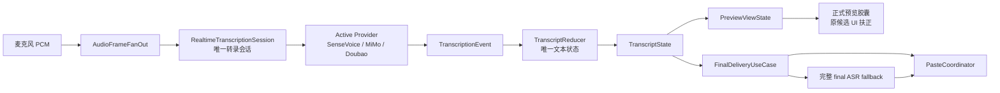

# Single Realtime Transcription Architecture Plan

> 架构师决策文档。后续进入“候选扶正 / 只保留一套预览与最终交付链路”相关开发前，必须先读本文件，再读 `2026-07-11-realtime-transcription-shadow-capsule.md` 的 Execution Progress。

Date: 2026-07-18
Status: **Conditional Accepted**
Decision owner: TypeWhale technical architecture
Product owner: 用户 / TypeWhale 董事长
Scope: macOS 语音输入的实时预览、候选/原胶囊、统一转录核心、Provider 路由、最终粘贴文本来源、旧预览链路退休。

## Decision

最后只保留一套时，选择“候选/统一转录核心扶正后的新主链路”，不选择旧预览链路继续演进。

但这个选择是有条件的：新链路必须先通过本地 SenseVoice、在线 Provider、长录音、最终粘贴、UI 体验、失败兜底和可观测性门禁。旧链路在这些门禁通过前继续作为生产安全网，不允许直接删除。

一句话：

> 旧链路负责保护当前可用体验；新链路负责成为未来唯一架构。迁移结束后，UI 只剩一个正式胶囊，最终粘贴只从统一转录核心拿文本，完整 final ASR 只作为失败兜底或用户显式开关。

## Why Now

Build 757–762 已经把候选从“纯展示实验”推到了最终交付边界，暴露出旧计划的目标已经变化：

- 原计划的核心约束是“旁路只能观察，不参与 final / paste”。
- 当前真实目标已经变成“候选架构扶正，最终替换旧预览和旧粘贴默认链路”。
- 如果继续沿用旧计划，开发会反复在“影子观察”和“生产接管”之间摇摆，造成同一个 bug 被不同补丁反复修。

因此需要一个新的架构计划，明确：

- 哪套架构最终保留；
- 每一层谁拥有数据真相；
- 哪些旧代码只是迁移桥；
- 什么证据足够让旧链路退休；
- 什么情况必须回滚或停止。

## Evidence Ledger

### Confirmed facts

- `SpeechInputCoordinator` 目前仍集中拥有录音、实时预览、候选 runtime、final ASR、粘贴和多个清理路径。
- 新核心已有 `TranscriptionSession`、`TranscriptionEvent`、`TranscriptReducer`、`PreviewViewState`、`TranscriptionProvider`。
- 候选 UI 已有分层：`PreviewViewState -> CandidatePresentationModel -> CandidateRenderState -> CandidatePreviewView`。
- 本地 fallback 已有真实 `SenseVoiceSnapshotProvider`，并通过 PCM fan-out 接收录音帧。
- 在线侧已有 Doubao / MiMo Provider 路由与 Keychain 凭证边界；MiMo 是 snapshot/WAV input + SSE text response，不是连续音频流。
- Build 760 修正了最终交付源：本地 fallback 不再优先取 legacy candidate adapter，而是优先取真实 `shadow-runtime-cache`。
- Build 761/762 修正了停止时尾部 snapshot 和停止后准入，避免 completed 只表示“旧队列跑完”。
- 旧预览链路仍存在，并且曾表现出尾部缺失、性能/动画耦合、与候选体验不一致等问题。
- 当前 Stage 9A 仍未关闭，不能宣称长录音已根治。

### Inferences

- 旧预览链路的问题不是单一 UI bug，而是数据生产、展示缓存、最终交付和收尾时序混在一起导致的结构性问题。
- 候选架构虽然目前还在迁移态，但它已经具备更正确的长期边界：Provider 产出统一事件，Reducer 拥有 transcript 状态，UI 只消费 ViewState。
- 最终只保留旧链路会继续把新 Provider、本地长录音、在线 ASR 和 UI 动效塞进旧协调器，后续维护成本会继续上升。

### Assumptions

- 用户目标是让 TypeWhale 的实时预览和最终粘贴在真实使用中稳定，而不是保留双胶囊作为长期产品形态。
- 完整 final ASR 可以保留为兜底和显式开关，但不应是默认长录音体验的唯一依赖。
- 新架构允许分阶段接管，不要求一次性删除所有旧代码。

### Decision-sensitive unknowns

- 真实本地 SenseVoice shadow runtime 在 20 秒、2 分钟、10 分钟连续语音下是否能稳定覆盖停止点并保持完整文本。
- MiMo / 豆包在线模式在真实网络、真实账户、真实长输入下的延迟、成本、失败率、文本回滚行为是否适合作为生产 Provider。
- 候选扶正后的单胶囊 UI 是否在视觉节奏、焦点、遮挡、闪烁和长文本增长上满足真实使用。

这些未知不阻止选择目标架构，但阻止立即删除旧链路。

## Architecture Drivers

Priority order:

1. **最终文本完整性**：用户停止录音后，粘贴文本不能系统性丢开头、丢中间或丢尾部。
2. **实时可感知**：预览应快速出字，停止前可持续增长，不能明显卡顿、闪烁、重复从头刷新。
3. **单一文本真相**：同一轮录音只能有一个最终 transcript authority；UI 不得修补、裁剪或决定最终文本。
4. **Provider 可替换**：本地 SenseVoice、Mimo、豆包必须通过同一事件/状态契约接入，Provider 私有机制不能泄漏到 UI。
5. **旧功能完整继承**：新预览窗口可以重新设计，不必复制旧胶囊外观；但必须包含旧预览窗口承担过的全部功能能力，并且不能降低已验证的好体验。
6. **失败安全**：新链路失败、为空、异常短、超时或凭证缺失时，不影响录音和粘贴，可 fallback 完整 final ASR。
7. **可观测**：每轮录音必须能从日志说明：使用哪个 Provider、候选是否 completed、最终文本来自哪里、为何 fallback。
8. **渐进退休**：旧链路只在新链路有真实证据后退休；不能 big bang。

## Candidate Comparison

### Candidate A: 继续修旧预览链路，并删除候选

Rejected.

Benefits:

- 短期改动少。
- 当前用户已有使用习惯。

Liabilities:

- 旧链路把数据缓存、UI 展示、final fallback 和收尾行为缠在一起。
- 不适合统一本地/在线 Provider。
- 已多次出现尾部、动画、粘贴来源和候选/原胶囊不一致问题。

Failure mode:

- 每次新增 Provider 或修 UI 都容易影响最终文本。

Exit cost:

- 后续仍要重新建统一核心，迁移成本只是被推迟。

### Candidate B: 保留双链路长期并行，用户自己选择

Rejected as final architecture.

Benefits:

- 迁移期安全。
- 便于 A/B 对照。

Liabilities:

- 产品心智复杂。
- 日志和 bug 归因复杂。
- 两套最终文本来源会继续造成“不知道到底该信谁”的问题。

Valid use:

- 只允许作为迁移期验证形态，不允许成为长期产品架构。

### Candidate C: 候选/统一转录核心扶正为唯一主链路，旧链路阶段性退休

Conditional Accepted.

Benefits:

- 单一 transcript authority。
- Provider 和 UI 分层清晰。
- 本地、在线、未来流式 Provider 可统一接入。
- 最终粘贴和预览能来自同一核心状态。

Liabilities:

- 需要补齐真实长录音证据。
- 需要谨慎处理旧链路退休，避免破坏当前可用体验。
- `SpeechInputCoordinator` 仍需拆出更多 application use case，否则主链路接管后仍会集中复杂度。

Failure mode:

- 新核心 completed 但未覆盖停止点。
- Provider 文本短于 legacy / final ASR。
- UI 扶正后出现闪烁、重复绘制或焦点问题。

Mitigation:

- 阶段门禁、source 日志、fallback final ASR、旧链路可回滚。

## Selected Architecture

最终目标拓扑：



### Boundary responsibilities

#### Audio

- `AudioRecorder` / `AudioFrameFanOut` 只负责采集与有界广播 PCM。
- 不决定文本、不决定 final、不决定 UI。

#### Realtime core

- `TranscriptionSession` 负责 session 生命周期、Provider epoch、事件顺序、取消和 completed。
- `TranscriptReducer` 是唯一 transcript state owner。
- `PreviewStateProjector` 只把状态投影成 UI 可消费的 ViewState。

#### Provider

- SenseVoice / MiMo / Doubao 只把各自私有机制翻译成统一 `TranscriptionEvent`。
- Provider 内可以有 snapshot、SSE、WebSocket、校正窗口、回滚规则，但这些不能进入 UI 层。

#### UI

- 正式胶囊只消费 `PreviewViewState`。
- Candidate/新原胶囊扶正后，UI 不得处理数据完整性，不得决定 final 文本。

#### Final delivery

- 默认从 `TranscriptState` 取 completed/stable + volatile tail 的交付快照。
- 如果新核心失败、为空、异常短、未 completed 或覆盖不足，fallback 完整 final ASR。
- 用户显式开启“停止后重新识别整段录音”时，完整 final ASR 可优先。

#### Legacy

- `LegacyPreviewShadowAdapter` 只允许作为迁移桥和 fail-open 兜底。
- 不允许作为长期 final 默认来源。
- 不允许与正式胶囊 UI 共同决定文本真相。

## Execution Contract

### Allowed changes

- 新增/调整 Application 层 use case，把 final delivery 从 `SpeechInputCoordinator` 中继续拆出。
- 让正式胶囊订阅统一 `PreviewViewState`。
- 增加 Provider-level coverage diagnostics。
- 增加真实录音日志门禁。
- 保留完整 final ASR fallback。
- 保留旧链路可回滚入口，直到退休门禁通过。

### Forbidden changes

- 不得一次性删除旧预览链路。
- 不得让 UI 层修补、截断、拼接 transcript。
- 不得让 Provider 私有字段进入 Candidate UI。
- 不得默认发送音频到在线 Provider，除非用户选择并已配置 Key。
- 不得宣称长录音完成，除非 20 秒、2 分钟、10 分钟真实证据通过。
- 不得用“等 N ms”作为完整性判断；时间上限只能防卡死，不能代表可交付。

## Development Stages

### Stage A — Architecture Contract Freeze

Purpose:

- 把“新核心最终唯一主链路”的目标固化为代码边界和文档约束。

Entry evidence:

- Build 762 已安装。
- `candidate_delivery_cache source=shadow-runtime-cache` 已出现。
- Stage 9A 未关闭。

Allowed changes:

- 文档、ADR、源码边界测试。
- 不改变用户可见行为。

Exit evidence:

- 本文件存在并被旧计划引用。
- 新增边界测试证明 UI 不处理 final 文本、legacy adapter 不能作为本地 fallback 最终默认源。

Rollback:

- 删除文档/边界测试，不影响运行时。

### Stage B — Realtime Core Coverage Gate

Purpose:

- 证明本地 SenseVoice runtime 的 `completed` 代表覆盖到停止点，而不是只代表旧队列 drained。

Allowed changes:

- Provider diagnostics：记录 `audio_duration_ms`、`last_recognized_audio_end_ms`、`tail_gap_ms`、`completed_recognitions`、`admission_skipped`。
- Provider / session 级测试。

Exit evidence:

- 20 秒真实录音：`tail_gap_ms <= 500` 或有等价证据；最终候选文本不短于 final ASR 明显阈值。
- 2 分钟真实录音：无明显末尾丢字；无无限增长队列；CPU/RSS 可接受。
- 失败时 `final_asr_result source=final_asr`，不粘贴异常短候选。

Rollback:

- 保留旧 final ASR fallback；关闭 candidate final default。

### Stage C — Final Delivery UseCase Extraction

Purpose:

- 把最终文本选择从 `SpeechInputCoordinator` 拆成独立 use case，降低主协调器复杂度。

Allowed changes:

- 新增 `FinalDeliveryUseCase` 或等价 Application 服务。
- 输入：recording task、transcript snapshot、preview snapshot、user switch、provider diagnostics。
- 输出：final text + source + reason。

Protected invariants:

- UI 不参与选择。
- Provider 不知道粘贴策略。
- 完整 final ASR fallback 保留。

Exit evidence:

- 测试覆盖：
  - transcript completed 且完整 -> 用 transcript；
  - transcript completed 但异常短 -> final ASR；
  - transcript running / failed / empty -> final ASR；
  - 用户开启完整识别 -> final ASR；
  - online missing key -> 本地或 final fallback。

Rollback:

- Coordinator 恢复调用现有 `FinalRecognitionUseCase`。

### Stage D — Candidate UI Becomes Official Capsule

Purpose:

- 将候选 UI 扶正为唯一正式预览窗口，同时保留旧胶囊 behind kill switch。
- 新正式预览窗口允许重新设计，不要求外观、布局和动效机械复制旧胶囊；设计目标是更清晰、更稳定、更适合统一转录核心。
- 重新设计不得牺牲旧预览窗口已有功能。旧功能必须作为兼容清单进入验收，而不是靠“看起来差不多”判断。

Allowed changes:

- 胶囊/窗口 label 从“候选”改为正式产品语义。
- 可以调整窗口形态、视觉层级、文本布局、状态标识、动效节奏和辅助信息展示。
- UI 订阅统一 ViewState。
- 动效只装饰显示，不影响文本可见性和最终交付。

Required legacy-function compatibility:

- 启动录音后立即出现，不抢焦点。
- 能持续展示实时转录文本，并能承载长文本增长。
- 能明确区分录音中、识别中、取消、失败、空输入、完成/隐藏等状态。
- 能表达 stable / volatile 文本关系；修订只影响 volatile，不倒退 stable。
- 能在自然停顿中保持上下文，不突然清空已确认内容。
- 能在停止录音时安全收尾并隐藏，不残留 stale window。
- 能跟随旧目标窗口位置策略，不遮挡用户主要输入区域、菜单栏、刘海或关键内容。
- 能在本地、Mimo、豆包、缺 Key、在线关闭、Provider 失败时保持一致的状态语言。
- 能支持原有主流程：录音、VAD/自动结束、final/fallback、整理/翻译/OpenClaw 入口不被 UI 改动破坏。
- 能保留可诊断日志；用户看 UI，开发看 source/fallback/lifecycle/tail gap。

Exit evidence:

- 关闭在线、本地 fallback、Mimo、豆包三种来源下 UI 行为一致。
- 20 秒和 2 分钟真实录音无明显闪烁、重复从头刷新、粘贴为空。
- 设计复核通过：位置、节奏、遮挡、暗色/亮色、停止隐藏。
- 旧功能兼容清单逐项 PASS；如有刻意改变，必须说明为什么新设计优于旧体验，且用户确认。

Rollback:

- 切回旧胶囊为可见主胶囊。

### Stage E — Online Provider Parity Gate

Purpose:

- 证明在线 Provider 可以在同一核心契约下工作，而不是为 Mimo/豆包写 UI 特例。

Allowed changes:

- Provider 内优化 Mimo / Doubao request projection、rollback handling、error mapping。
- 增加 source diagnostics。

Exit evidence:

- Mimo 配 Key 后真实消耗可见、文本有明确 source、失败可 fallback。
- Doubao 缺 Key/无 Key/失败路径可诊断且不阻塞本地。
- 在线关闭时本地模型自然接管。

Escalated decisions:

- 默认是否启用在线模型、成本/隐私/保留策略，需要产品/安全确认；架构只提供边界。

Rollback:

- Online selection 设置为 off；本地 Provider / final ASR 保持可用。

### Stage F — Legacy Retirement Gate

Purpose:

- 删除或冻结旧预览链路，只保留新核心主链路。

Entry evidence:

- Stage B–E 全部通过。
- 至少连续若干真实录音样本无尾字丢失、无粘贴空、无 UI 退化。
- 旧链路没有最近一次救场记录。

Allowed changes:

- 删除旧胶囊生产默认路径。
- 删除长期不再使用的 legacy adapter 默认分支。
- 更新 `ARCHITECTURE.md` 为新主链路。

Exit evidence:

- 单胶囊真实安装版通过：
  - 20 秒；
  - 2 分钟；
  - 10 分钟；
  - 取消恢复；
  - 连续录音；
  - 在线 off；
  - online missing key；
  - Mimo ready；
  - 豆包 ready 或缺 Key。

Rollback:

- 只在删除前保留一个明确 release tag / commit。
- 若删除后出现 P0 回退，需要恢复旧胶囊路径或强制 final ASR fallback。

## Observability Requirements

每轮录音至少能通过日志回答：

- `task_id`
- active provider：`sensevoice_snapshot` / `mimo` / `doubao` / `final_asr`
- online selection 和 credential 状态，不记录 key
- audio duration
- accepted audio frames
- last recognized audio end / tail gap
- transcript lifecycle
- candidate delivery source
- fallback reason
- final paste source
- paste outcome

推荐日志字段：

```text
candidate_delivery_cache
  task_id
  chars
  source
  usable
  deliverable
  lifecycle
  tail_gap_ms
  fallback_reason

shadow_sensevoice_summary
  accepted_frames
  completed
  admission_skipped
  last_audio_end_ms
  tail_gap_ms
  provider_service_ms
```

## Retirement Criteria

旧预览链路可以退休的最低条件：

- 本地 SenseVoice：20 秒、2 分钟、10 分钟真实录音全部通过。
- 在线 off：本地接管正常。
- Mimo ready：真实请求可用，失败 fallback 正常。
- 豆包路径：至少缺 Key、配置 Key、失败 fallback 可诊断；真实可用性由用户提供 Key 后验证。
- UI：单胶囊无明显闪烁、重复绘制、遮挡或焦点问题。
- 粘贴：最终文本和预览状态同源；fallback reason 可解释。
- 取消/连续录音：无 stale event 更新新 session。
- 日志门禁：能自动判定上述样本存在。

## Review Triggers

任一情况发生，必须重新 review 架构，不得继续局部补丁：

- completed 但 tail gap 仍大于门限。
- 候选/正式胶囊显示文本多于最终粘贴文本，且不是显式 fallback。
- UI 层出现任何文本修补逻辑。
- Provider 私有字段进入 Presentation 层。
- 在线 Provider 失败导致录音或粘贴阻塞。
- 长录音 2 分钟以上再次系统性丢字。
- 为修一个 Provider 需要改 Candidate UI。

## Handoff To Implementation

下一步应执行 Stage A，然后 Stage B。

实施者每次开发前必须：

1. 读取本文件。
2. 读取旧计划的 Execution Progress。
3. 明确本轮属于哪个 Stage。
4. 先写失败测试或日志门禁。
5. 改代码。
6. 跑聚焦测试。
7. 构建安装。
8. 用真实日志更新本文件和旧计划。

当前建议的下一项代码任务：

> Stage B-1：增加 SenseVoice shadow coverage diagnostics，记录最后识别覆盖到的音频时间与停止点差距；用真实日志判断 Build 762 后 final tail 是否已经追到停止点。
